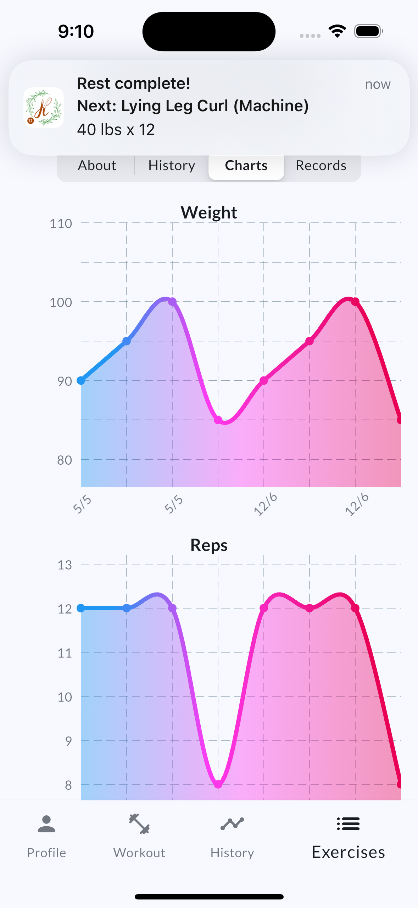
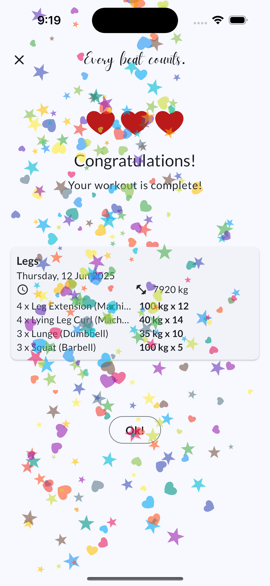

# Heart of yours

Every beat counts.

## Introduction

Heart of yours is a minimalist fitness tracker mobile app that collects and aggregates your workout
data. It is also a
showcase of a real-live serverless Flutter project.

<div style="display: flex; justify-content: space-around; align-items: center; gap: 10px;">
  
  
  
</div>

## Prerequisites

- Dart 3.6+
- Flutter 3.27+
- a Firebase account
- Flutterfire CLI
- XCode (for iOS)
- optionally, an Apple developer account for the Apple sign-in feature (iOS only)
- optionally, a Sentry account

## Architecture overview

The project has the following general structure.

```
├── android
    └──...
├── assets
    └── fonts
├── env
    └── dev.json
        ...
├── firebase.json
├── ios
    └── ...
├── lib
    ├── core
    ├── firebase_options.dart
    ├── firestore.rules
    ├── main.dart
    └── presentation
├── pubspec.yaml
├── shared
    ├── heart_api
    ├── heart_charts
    ├── heart_db
    ├── heart_language
    ├── heart_models
    └── heart_state
└── test
    └── ...
```

This is a slightly modified MVVM-style architecture where the domain and data layers live in dedicated packages:
- Domain models and service contracts: `shared/heart_models`
- Local persistence (SQLite): `shared/heart_db`
- App state and business workflows (Provider): `shared/heart_state`
- Localization strings and delegates: `shared/heart_language`
- HTTP client for the backend: `shared/heart_api`
- Reusable charts for UI: `shared/heart_charts`

In this app, the UI depends on `heart_state` and the domain interfaces from `heart_models`. Concrete I/O lives behind those interfaces (`heart_db` for local storage and `heart_api` for remote HTTP). The app aims to avoid tight coupling to transport details; Firebase usage (if any) is encapsulated within state modules and not directly imported by UI code, preserving separation of concerns.

## To set up

One can run this up if they go through
the [usual Firebase setup process](https://firebase.flutter.dev/docs/overview/).
High level steps are:

- Get a Firebase account
- Start a Firebase project
- Start a **Flutter** app in that project - the code right supports Android and iOS but this might
  change in the future.
  Setting up an Android and iOS apps separately is of course completely fine, but the Flutter option
  is easier and
  faster.
- Generate the Firebase project credentials as per the link above.

Ultimately, the setup process is in no way different from any boilerplate Flutter + Firebase
project.

## To run

The app is set up to run with flavours. The configuration is passed to the app with `dart-define`.
First, we'll create a `env/dev.json` file that looks like this:

```json
{
  "ENV": "dev",
  "LOG_LEVEL": "ALL",
  "SENTRY_DSN": "https://111@222.ingest.us.sentry.io/3333",
  "SENTRY_ENVIRONMENT": "dev"
}
```

Populate this with your values. Full list of variables is in `lib/core/env/config.dart`.

Then, to run:

```shell
flutter run --dart-define-from-file="env/dev.json"
```

on iOS and

```shell
flutter run --flavor dev --dart-define-from-file="env/dev.json"
```

on Android. This will change when we'll get closer to the release.

## State management

We use [`provider`](https://pub.dev/packages/provider) for state management as a Flutter-native
solution recommended by
the Flutter team. All business logic is localized in the `heart_state` package, and it also
exposes `provider` to the
app.

## Packages

Each shared package has its own README with details and quick starts:
- [heart_models](shared/heart_models/README.md): domain models and service interfaces
- [heart_db](shared/heart_db/README.md): local persistence (SQLite via sqflite)
- [heart_state](shared/heart_state/README.md): Provider-based state and business workflows
- [heart_language](shared/heart_language/README.md): localization strings and delegates
- [heart_api](shared/heart_api/README.md): HTTP client for the Heart backend
- [heart_charts](shared/heart_charts/README.md): reusable chart widgets

## To test

We test the app and each package separately. From the repo root:

- Get dependencies once:
  ```shell
  flutter pub get
  ```

- Run tests for a specific package (some packages require code generation first):
  ```shell
  # heart_models (requires build_runner)
  dart run build_runner build --delete-conflicting-outputs
  flutter test shared/heart_models

  # heart_api (if it uses generated code)
  dart run build_runner build --delete-conflicting-outputs
  flutter test shared/heart_api

  # heart_db
  flutter test shared/heart_db
  ```

- Run the app tests:
  ```shell
  flutter test
  ```

## CI

Right now, the project has [a unit test GitHub action](.github/workflows/unit-tests.yml).
