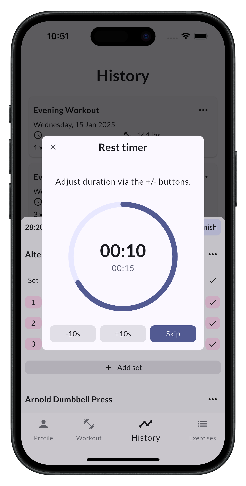
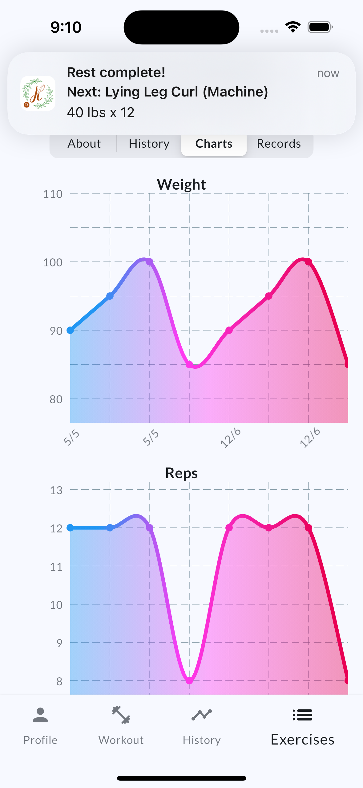
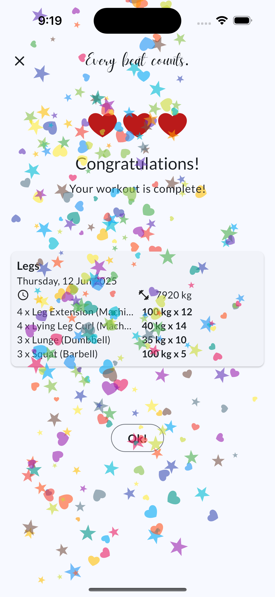

# Heart of yours

Every beat counts.

## Introduction

Heart of yours is a minimalist fitness tracker that collects and aggregates your workout data. It
is also a showcase of a real-live serverless Flutter project.

<div style="display: flex; justify-content: space-around; align-items: center; gap: 10px;">
  
  
  
</div>

## Supported platforms

iPhone and Android phones, and **iPad and Android tablets** in both orientations. Phones are
portrait-only; tablets follow the device.

Large screens are not a phone layout stretched wide. The navigation bar becomes a rail, History and
Exercises become two-pane, and grids count their columns from the width they are actually given.
The rules for keeping it that way are in [CLAUDE.md](CLAUDE.md#large-screens) — the short version is
that each page measures its own constraints rather than the window, and caps what it does with
them.

## Prerequisites

- Dart 3.12+
- Flutter 3.44+ (the app uses dot-shorthand enum and constructor syntax; CI installs the
  version pinned in `.flutter-version` — bump that one file to move CI)
- a Firebase account
- Flutterfire CLI
- XCode (for iOS)
- optionally, an Apple developer account for the Apple sign-in feature (iOS only)
- optionally, a Sentry account

## Architecture overview

The project has the following general structure.

```
├── android
    └──...
├── assets
    └── fonts
├── env
    └── dev.json
        ...
├── firebase.json
├── integration_test
    └── ...
├── ios
    └── ...
├── lib
    ├── core
    ├── firebase_options.dart
    ├── firestore.rules
    ├── main.dart
    └── presentation
├── pubspec.yaml
├── shared
    ├── heart_api
    ├── heart_charts
    ├── heart_db
    ├── heart_language
    └── heart_state
└── test
    └── ...
```

This is a slightly modified MVVM-style architecture where the domain and data layers live in dedicated packages:
- Domain models and service contracts: `heart_models` — lives in the
  [heart-api](https://github.com/kit-g/heart-api) repository and is pulled in as a git dependency
- Local persistence (SQLite): `shared/heart_db`
- App state and business workflows (Provider): `shared/heart_state`
- Localization strings and delegates: `shared/heart_language`
- HTTP client for the backend: `shared/heart_api`
- Reusable charts for UI: `shared/heart_charts`

In this app, the UI depends on `heart_state` and the domain interfaces from `heart_models`. Concrete I/O lives behind those interfaces (`heart_db` for local storage and `heart_api` for remote HTTP). The app aims to avoid tight coupling to transport details; Firebase usage (if any) is encapsulated within state modules and not directly imported by UI code, preserving separation of concerns.

## To set up

One can run this up if they go through
the [usual Firebase setup process](https://firebase.flutter.dev/docs/overview/).
High level steps are:

- Get a Firebase account
- Start a Firebase project
- Start a **Flutter** app in that project. The code targets Android and iOS; a web build is planned
  but not worked on yet. Setting Android and iOS up separately is fine, but the Flutter option is
  easier and faster.
- Generate the Firebase project credentials as per the link above.

Two generated files are required to compile the app and are deliberately not tracked:
`lib/firebase_options.dart` and `lib/firebase_options_prod.dart`. `flutterfire configure` produces
the first; the second is the same thing generated against the prod Firebase project (with a single
Firebase project, a copy of the dev file with the class renamed works for local development).
`firebase.json` is likewise untracked and recreated by `flutterfire configure`. Tests do not need
any of these — only builds do.

Then bootstrap the workspace (dependencies, code generation, git hooks):

```shell
make bootstrap
```

## To run

The app is set up to run with flavours. The configuration is passed to the app with `dart-define`.
First, we'll create a `env/dev.json` file that looks like this:

```json
{
  "ENV": "dev",
  "LOG_LEVEL": "ALL",
  "SENTRY_DSN": "https://111@222.ingest.us.sentry.io/3333",
  "SENTRY_ENVIRONMENT": "dev"
}
```

Populate this with your values. Full list of variables is in `lib/core/env/config.dart`.

Then, to run:

```shell
flutter run --flavor dev --dart-define-from-file="env/dev.json"
```

The flavour is required on both platforms. On iOS, omitting it fails the build at `actool` with
*"None of the input catalogs contained ... an app icon set named AppIcon"* — the asset catalog holds
`AppIcon-dev` and `AppIcon-prod` and no unflavoured `AppIcon`.

To pick a device, pass `-d` with an id from `flutter devices`:

```shell
flutter devices
flutter run --flavor dev -d "iPad Pro 11-inch (M4)" --dart-define-from-file="env/dev.json"
```

Since tablets are supported, run on one before calling a UI change done. There is no Android tablet
emulator by default — create one with
`avdmanager create avd -n Pixel_Tablet -k "system-images;android-34;google_apis;arm64-v8a" -d pixel_tablet`.

`lib/main_driver.dart` is a debug-only entrypoint that enables the Flutter Driver extension, so a
running app can be tapped, scrolled and screenshotted from outside. See the `drive-the-app` skill.

## State management

We use [`provider`](https://pub.dev/packages/provider) for state management as a Flutter-native
solution recommended by
the Flutter team. All business logic is localized in the `heart_state` package, and it also
exposes `provider` to the
app.

## Packages

Each in-repo shared package has its own README with details and quick starts
(`heart_models` is documented in [heart-api](https://github.com/kit-g/heart-api)):
- [heart_db](shared/heart_db/README.md): local persistence (SQLite via sqflite)
- [heart_state](shared/heart_state/README.md): Provider-based state and business workflows
- [heart_language](shared/heart_language/README.md): localization strings and delegates
- [heart_api](shared/heart_api/README.md): HTTP client for the Heart backend
- [heart_charts](shared/heart_charts/README.md): reusable chart widgets

## To test

The whole matrix, exactly as CI runs it (codegen included):

```shell
make test
```

Individual suites have sub-targets — `make test-heart_db`, `make test-heart_state`,
`make test-heart_api`, `make test-heart_charts`, `make test-heart_language`, `make test-app`.
Static analysis is `make lint` (also the pre-push hook installed by `make bootstrap`).

Integration tests live in `integration_test/` and need a device, so they do not run under a plain
`flutter test`:

```shell
flutter test integration_test/ -d <device-id>
```

They are written as the artefact for Firebase Test Lab (tablet coverage without owning the
hardware), but no CI job runs them yet — they are manual for now.

## CI

All workflows live in [.github/workflows](.github/workflows) and call the same `make` targets
developers run:

- [unit-tests.yml](.github/workflows/unit-tests.yml) — analyze + the full test matrix, on every PR
  and push to main; superseded runs cancel.
- `android-dev.yml` / `ios-dev.yml` — deploy to Play internal track / TestFlight on pushes to main
  that touch app code; gated on the unit-test workflow.
- `android-prod.yml` / `ios-prod.yml` — prod deploys, from tags only (`v*`, `android*` / `ios*`),
  also test-gated.
- `google-play-deployment.yml` / `testflight-ios-deployment.yml` — reusable deploy recipes the
  above call; secrets come from S3 via OIDC. Play uploads land as drafts and are promoted manually
  in the console.

A newer deploy cancels a superseded in-flight one (latest code wins); every workflow installs
the Flutter version pinned in `.flutter-version`.
