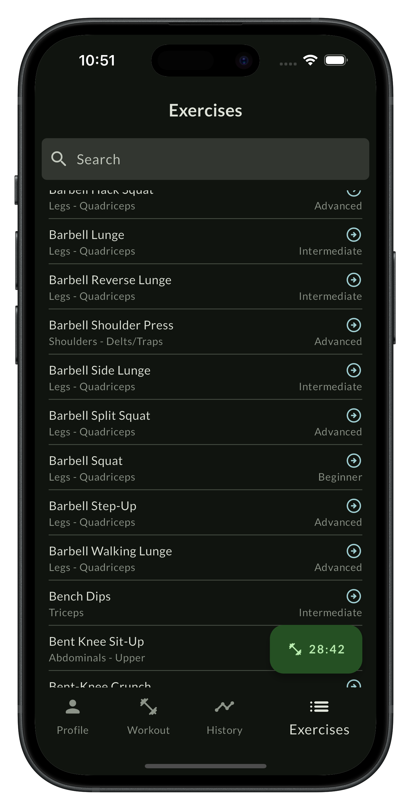
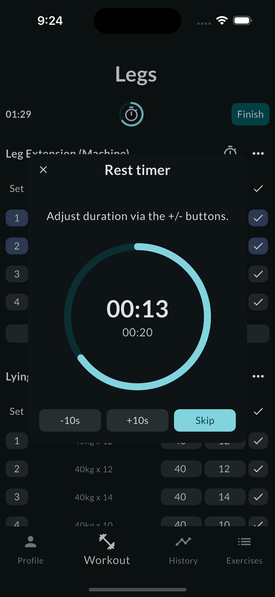

# Heart of yours

Every beat counts.

## Introduction

Heart of yours is a minimalist fitness tracker mobile app that collects and aggregates your workout
data. It is also a
showcase of a real-live serverless Flutter project.

<div style="display: flex; justify-content: space-around; align-items: center; gap: 10px;">
  
  
  
  
</div>

## Prerequisites

- Dart 3.6+
- Flutter 3.27+
- a Firebase account
- Flutterfire CLI
- XCode (for iOS)
- optionally, an Apple developer account for the Apple sign-in feature (iOS only)
- optionally, a Sentry account

## Architecture overview

The project has the following general structure.

```
├── android
    └──...
├── assets
    └── fonts
├── env
    └── dev.json
        ...
├── firebase.json
├── ios
    └── ...
├── lib
    ├── core
    ├── firebase_options.dart
    ├── firestore.rules
    ├── main.dart
    └── presentation
├── pubspec.yaml
├── shared
    ├── heart_language
    ├── heart_models
    └── heart_state
└── test
    └── ...
```

This is a slightly modified MVVM-architecture where the data layer is moved to its own package (or
two, rather -
`heart_models` and `heart_state`), plus the same happened to the app's copy (`heart_language`). In
this specific app,
there are no services (or service abstractions) since its backend is in Firebase and the Firestore
connection is private
to the `heart_state` package and is not exposed to the app. In fact, the app has no direct
dependency on Firebase and
this is how separation of concerns is achieved.

## To set up

One can run this up if they go through
the [usual Firebase setup process](https://firebase.flutter.dev/docs/overview/).
High level steps are:

- Get a Firebase account
- Start a Firebase project
- Start a **Flutter** app in that project - the code right supports Android and iOS but this might
  change in the future.
  Setting up an Android and iOS apps separately is of course completely fine, but the Flutter option
  is easier and
  faster.
- Generate the Firebase project credentials as per the link above.

Ultimately, the setup process is in no way different from any boilerplate Flutter + Firebase
project.

## To run

The app is set up to run with flavours. The configuration is passed to the app with `dart-define`.
First, we'll create a `env/dev.json` file that looks like this:

```json
{
  "ENV": "dev",
  "LOG_LEVEL": "ALL",
  "SENTRY_DSN": "https://111@222.ingest.us.sentry.io/3333",
  "SENTRY_ENVIRONMENT": "dev"
}
```

Populate this with your values.

Then, to run:

```shell
flutter run --dart-define-from-file="env/dev.json"
```

on iOS and

```shell
flutter run --flavor dev --dart-define-from-file="env/dev.json"
```

on Android. This will change when we'll get closer to the release.

## State management

We use [`provider`](https://pub.dev/packages/provider) for state management as a Flutter-native
solution recommended by
the Flutter team. All business logic is localized in the `heart_state` package, and it also
exposes `provider` to the
app.
